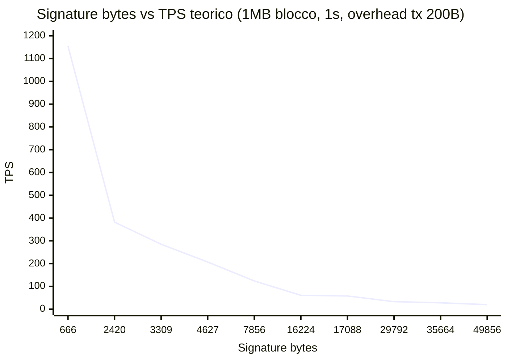
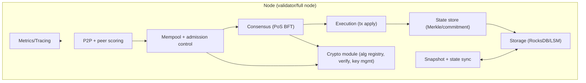

# Blockchain L1 post‑quantum‑native: report analitico e blueprint v0.1

> **Frozen 2026-04-09 — historical research input (Italian).** This was
> the early technical blueprint and trade-off analysis that informed
> the algorithm baseline and fee-model direction. It has been
> superseded by the `specs/` corpus, `ARCHITECTURE.md`, ADR-043 / ADR-046
> (consensus algorithm policy), and the `viper-pq-1` launch (2026-04-25).
> Statements about algorithm registry shape, validator set sizing, and
> phase plans no longer reflect the current implementation. Kept here
> for the audit trail.

## Executive summary

Una L1 “post‑quantum‑native” ha un obiettivo tecnico chiaro: eliminare la dipendenza da primitive vulnerabili a un computer quantistico (es. RSA/ECC) e progettare il protocollo assumendo **crescita significativa delle dimensioni di firme/chiavi** e **costi di verifica** rispetto alle firme classiche. citeturn31search0turn31search6 In pratica, per una L1 il collo di bottiglia non è “se esiste un algoritmo PQ”, ma **come le firme PQ impattano throughput, latenza, banda e storage** a livello di consenso e transazioni. citeturn6search0turn7view0turn11view0

Punti chiave emersi (con raccomandazioni operative):

- **Baseline algoritmica**: usare solo primitive con traiettoria di standardizzazione forte e implementazioni mature. Le prime tre norme PQC di entity["organization","NIST","us standards body"] sono già pubblicate come FIPS 203/204/205 (ML‑KEM, ML‑DSA, SLH‑DSA). citeturn26view0turn27search5 Inoltre, Falcon è selezionato e pianificato come FIPS 206 (nominato “FN‑DSA”), e HQC è stato selezionato per standardizzazione come ulteriore KEM. citeturn26view0turn25view0turn27search12
- **Scelta “default” per transazioni**: **ML‑DSA** ha firme da ~2.4–4.6 KB per i set principali e un ecosistema implementativo molto ampio; è un buon default per una L1 general‑purpose. citeturn21view1turn4view0  
  **Falcon (FN‑DSA)** offre firme molto più piccole (padded 666 B) ed è molto interessante per ridurre banda/storage, ma è “selected” (standard in sviluppo) e porta trade‑off implementativi/side‑channel più delicati; quindi va trattato come opzione forte ma con governance di rischio e crypto‑agility. citeturn21view4turn26view1  
  **SLH‑DSA** (hash‑based) è il “backup conservativo” (firme 7.8–49.9 KB) da usare per casi speciali (key rotation d’emergenza, riserve, recovery) più che per ogni transazione. citeturn23view1turn17view1
- **Consenso e firme PQ**: in BFT/PoS il “commit proof” contiene molte firme (2/3+1). Con firme PQ di pochi KB, il commit per blocco può diventare centinaia di KB se il validator set cresce, influenzando latenza e banda. Questo spinge verso: (a) validator set più piccolo inizialmente; (b) design che minimizza materiale firmato in header; (c) esplorazione di aggregazione alternativa (es. SNARK) — tema discusso anche in ambito entity["organization","Ethereum","blockchain protocol"] (“SNARK‑based aggregation”). citeturn1search0turn20search0
- **Formato transazione e fee model**: la fee deve prezzare esplicitamente **byte‑cost** (banda/storage) e **verify‑cost** (CPU), altrimenti si apre una superficie DoS “economica” (spam di firme grandi/costose). citeturn6search0turn15search1
- **Storage strategy**: riduci il carico persistente con pruning dello stato, snapshot/state‑sync e architettura dati efficiente (LSM/RocksDB), ma ricorda che la “data availability” dei blocchi (inclusi i bytes delle firme) resta un costo strutturale: la vera ottimizzazione è **evitare firme enormi nel path comune**. citeturn15search2turn15search3turn19search0
- **Rischi regolatori**: se la chain viene usata per emissione/servizi su cripto‑asset in UE, il perimetro MiCA e gli obblighi AML/CFT (FATF R.15, Travel Rule tramite CASP) toccano soprattutto ecosystem/app layer, ma influenzano anche scelte L1 (auditability, logging, governance upgrade). citeturn16search0turn16search5turn16search3

Assunzioni non specificate dal prompt (trattate più avanti con profili alternativi): **TPS target**, **budget**, **timeline**.

## Obiettivo del progetto e profili di assunzioni

**Obiettivo**: costruire da zero una L1 con sicurezza “quantum‑resistant by design”, cioè:
- nessuna dipendenza critica da firme ECC/RSA in consenso, transazioni, P2P identity; citeturn31search0turn31search6
- protocollo e governance con **crypto agility** (registrazione algoritmi, deprecazione, migrazione account/chiavi senza hard reset); citeturn26view1turn15search0
- economics (fee) che coprono i costi reali di verifica e banda introdotti dalle firme PQ. citeturn6search0turn7view0

Per rendere il report operativo senza un TPS target dichiarato, propongo tre profili di progetto (parametri indicative, sostituibili):

| Profilo | Target TPS (ordine di grandezza) | Block time | Block payload target | Conseguenza principale con firme PQ |
|---|---:|---:|---:|---|
| Conservativo | ~50 | 2 s | ~1 MB | vincolo basso su banda; spazio per firme grandi solo in operazioni rare |
| Medio | ~200 | 1 s | ~2 MB | firme da pochi KB influiscono sui costi; serve fee model “byte+verify” rigoroso |
| Aggressivo | ~800 | 1 s (o <1 s) | ~8 MB | banda e storage dominano; SLH‑DSA in hot path diventa improponibile; commit BFT va ottimizzato |

Le stime quantitative sotto useranno, dove necessario, il profilo “medio” come baseline (1 s, 2 MB), e mostreranno scaling a 1 MB e 8 MB.

## Threat model classico e quantistico

Una L1 “PQ‑native” deve modellare attaccanti **classici** + **quantistici**. In più, deve assumere l’esistenza di strategie “harvest‑now, decrypt‑later” (raccolta oggi, decrittazione quando disponibile CRQC), particolarmente rilevanti per traffico cifrato e dati a lunga confidenzialità. citeturn31search6turn31search0

### Superfici di attacco principali

| Superficie | Attacco classico | Attacco quantistico | Impatto su L1 | Mitigazioni “PQ‑native” |
|---|---|---|---|---|
| Firme transazioni | furto chiavi, malware, nonce/account replay, implementazioni non constant‑time | forgiatura firme se algoritmo classico (ECC/RSA) o se PQ vulnerabile | furto fondi, censura, doppie spese | firme NIST PQ (ML‑DSA default; SLH‑DSA fallback); account nonce; key rotation; audit/CT; hardening HSM |
| Consenso BFT/PoS | equivocation, long‑range attacks (PoS), bribery, network partition | se firme classiche: rottura identità/validazione di vote/commit | rottura safety/finality | usare firme PQ per vote/commit; governance per rotation e slashing; min‑validator set iniziale; rate limit |
| P2P / handshake | MITM, eclipse, Sybil, poisoning | “decrypt later” su canali cifrati classici | perdita privacy/metadata, takeover peer graph | ML‑KEM per key agreement; identity keys PQ; policy peer scoring |
| Serializzazione tx e hashing | malleabilità, ambiguità encoding, hash collision engineering | Grover riduce margine in brute-force (soprattutto simmetrici) | fork di consenso per interpretazioni diverse | encoding deterministico; hash moderni (SHA‑2/SHAKE) e parametri adeguati; domain separation citeturn15search0turn15search8turn31search3
| DoS economico | spam tx “cheap”, verify‑cost non prezzato | firme PQ grandi rendono il DoS più efficace | congestione mempool e blocchi | fee per byte + fee per verify; verify budget per blocco; mempool admission control citeturn6search0turn7view0

Nota sulle primitive: entity["organization","NIST","us standards body"] esplicita che le norme PQ pubblicate mirano a resistere a “cryptographically relevant quantum computers” e ha rinominato gli algoritmi standardizzati in ML‑KEM/ML‑DSA/SLH‑DSA; Falcon sarà FN‑DSA (FIPS 206). citeturn26view1turn27search5

## Primitive PQC raccomandate e stime prestazionali

Questa sezione confronta primitive PQC con parametri richiesti (tipo, size, verify cost, maturità, implementazioni, licenze). Per implementazioni open‑source e metadati (licenze, size, parameter summary) uso entity["organization","Open Quantum Safe","pqc open source project"] / entity["organization","liboqs","pqc c library"] come catalogo pratico, e FIPS NIST come fonte primaria. citeturn30search11turn30search2turn4view0

### Tabella comparativa “core set” per una L1

| Primitiva | Tipo | Parameter set consigliato (baseline) | Dimensioni (pub/priv/sig o ct) | Costo verifica (ordine di grandezza) | Maturità | Implementazioni OSS e licenze |
|---|---|---|---|---|---|---|
| ML‑DSA (FIPS 204) | Firma lattice | ML‑DSA‑65 (NIST L3) | pk 1952 B, sk 4032 B, sig 3309 B | ~55k verify/s per core su Zen4 (stima da eBATS) | Standard NIST | mldsa‑native (MIT/Apache/ISC), integrazioni in liboqs (MIT) |
| ML‑DSA (FIPS 204) | Firma lattice | ML‑DSA‑44 (NIST L2) | pk 1312 B, sk 2560 B, sig 2420 B | ~89k verify/s per core (stima da eBATS) | Standard NIST | come sopra |
| SLH‑DSA (FIPS 205) | Firma hash‑based stateless | SLH‑DSA‑SHA2‑128s (L1) come “fallback conservativo” | pk 32 B, sk 64 B, sig 7856 B | ~951 verify/s per core (proxy SPHINCS+ eBATS) | Standard NIST | ref/opt in liboqs; dimensioni molto grandi |
| Falcon (selezionato; futuro FN‑DSA) | Firma lattice (NTRU/FFT) | Falcon‑padded‑512 (L1) | pk 897 B, sk 1281 B, sig 666 B | ~62k verify/s per core (eBATS) | Selected NIST; FIPS 206 in sviluppo | PQClean commit (MIT), integrazioni varie in liboqs (MIT/Apache in alcune varianti) |
| ML‑KEM (FIPS 203) | KEM lattice | ML‑KEM‑768 (NIST L3) | pk 1184 B, sk 2400 B, ct 1088 B, ss 32 B | decap ~140k/s per core (eBATS) | Standard NIST | mlkem‑native (MIT/Apache/ISC), liboqs (MIT) |
| HQC (selezionato NIST) | KEM code‑based | HQC‑192 (L3) come “diversificazione portfolio” | pk 4522 B, sk 4586 B, ct 8978 B | più lento e più grande di ML‑KEM (eBATS round‑4 proxy) | Selected NIST (standard in arrivo) | liboqs (MIT) |

Dimensioni e parametri da cataloghi/standard: ML‑DSA size ufficiali. citeturn21view1turn4view0 SLH‑DSA size. citeturn23view1turn17view1 Falcon size (incl. padded). citeturn21view4 ML‑KEM size. citeturn23view3turn30search2 HQC size. citeturn23view2turn27search12

### Candidate rilevanti (NIST “Additional Digital Signatures”)

Per crypto‑agility, è utile monitorare anche il processo “Additional Digital Signature Schemes” di NIST (call chiusa 2023 e round successivi). citeturn27search3turn27search6 Nel round 2 (annuncio 2024) NIST lista 14 candidati (es. CROSS, MAYO, SNOVA, UOV, ecc.). citeturn27search6 In liboqs oggi sono evidenziati alcuni di questi come “on‑ramp” (CROSS, MAYO, SNOVA, UOV). citeturn21view2  
Raccomandazione: trattarli come “track di ricerca”, non baseline, fino a ulteriore convergenza/standardizzazione.

### Benchmark pratici su hardware server tipico

Per avere numeri concreti, uso dataset eBATS/SUPERCOP su una macchina “amd64; Zen 4; 2023 AMD Ryzen 7 7700; 8×3800MHz”. citeturn6search1turn7view0 I cicli misurati sono per implementazioni specifiche (es. dilithium2aes, falcon512tree, sphincs*) e vanno letti come **ordine di grandezza** per i corrispondenti standard/derivati (ML‑DSA ~ Dilithium; SLH‑DSA ~ SPHINCS+; FN‑DSA ~ Falcon). La mappatura dei nomi è esplicitata da NIST (rinomina ML‑DSA/SLH‑DSA e FN‑DSA). citeturn26view1turn25view0

#### Stime latenza e throughput (firma/KEM)

Approssimo: `tempo ≈ cycles / 3.8GHz`. Risultati mediani:

| Operazione (proxy) | Cicli mediani (eBATS) | Tempo stimato | Ops/s per core |
|---|---:|---:|---:|
| ML‑DSA‑44 verify (dilithium2aes) | 42,664 | ~11.23 µs | ~89k |
| ML‑DSA‑65 verify (dilithium3aes) | ~69,060 | ~18.17 µs | ~55k |
| FN‑DSA‑512 verify (falcon512tree) | ~60,789 | ~15.99 µs | ~62k |
| SLH‑DSA verify (proxy sphincss256sha256simple) | ~3,995,816 | ~1.05 ms | ~951 |
| ML‑KEM‑768 decapsulation | ~27,134 | ~7.14 µs | ~140k |

Fonti cicli: ML‑DSA verify. citeturn10view2turn10view1 Falcon verify. citeturn10view2turn7view2 SPHINCS verify. citeturn10view3turn7view3 ML‑KEM decap. citeturn13view1turn18view2

**Interpretazione**:
- per ML‑DSA e Falcon, la verifica firma è molto veloce su CPU server moderna; il limite TPS si sposta su **banda e storage della firma** più che su CPU. citeturn7view0turn6search0
- SLH‑DSA ha verify relativamente gestibile ma firme enormi; in un sistema ad alto TPS, impatta soprattutto I/O e costi economici per tx. citeturn23view1turn10view3

#### Grafico: firma vs TPS teorico (vincolo “solo banda”)

Assumo (esempio) `tx_overhead = 200 B` senza firma; `block = 1,000,000 B`; `block_time = 1s`. TPS teorico ≈ `block_size / (overhead + sig_bytes)`. È una stima utile per visualizzare l’ordine di grandezza dell’impatto firma. (La realtà include execution, mempool, latenza rete, ecc.)



Le dimensioni firma in input provengono dai riepiloghi parametrici (Falcon padded, ML‑DSA, SLH‑DSA). citeturn21view4turn21view1turn23view1

## Impatto su formato transazione, account model, consenso, fee, crypto‑agility, storage

### Formato transazione e versioning/serializzazione

Una chain PQ‑native deve prevenire ambiguità di encoding (malleabilità) perché **si firma byte‑per‑byte**. L’uso di formati non canonici è un rischio: ad esempio entity["organization","Protocol Buffers","data serialization format"] dichiara esplicitamente che la serializzazione protobuf “non è (e non può essere) canonical”. citeturn15search1turn15search5

Raccomandazione:
- usare **CBOR** con **Deterministic Encoding** (RFC 8949 + sezioni deterministiche / draft di determinismo), così da avere una canonica stabile e validabile in consensus. citeturn15search0turn15search8
- prevedere un `tx_version` e un `alg_id` esplicito in payload di firma (no “implicit negotiation”), coerente con l’approccio NIST in cui param set vanno noti/negoziati. citeturn26view1turn30search8

### Account model: alg_id, key rotation, multi‑algo

Trade‑off: “single‑algo chain” è più semplice ma fragile se un algoritmo viene deprecato. NIST stesso sottolinea la necessità di evoluzione/aggiornamento dei benchmark nel tempo (PQC FAQs). citeturn31search1

Proposta operativa:
- ogni account ha un **KeySet** con 1..N chiavi attive, ciascuna con:
  - `alg_id` (es. 0x01=ML‑DSA‑65, 0x02=FN‑DSA‑padded‑512, 0x03=SLH‑DSA‑128s, ecc.)
  - `pk_bytes`
  - `key_version` (monotona) e `valid_from_height`
  - policy `allowed_tx_types` (es. SLH‑DSA solo per rotation/recovery)
- transazione include `sig_alg_id`, `sig_key_version`, `sig_bytes`; il verifier seleziona la pk via `(account, key_version)`.

Questo abilita:
- **key rotation** senza fork dell’account space;
- **multi‑algo** e migrazione graduale;
- **emergency downgrade/upgrade** se un algoritmo viene “soft‑deprecato”.

### Consenso: opzioni e impatto firme PQ

Lato consenso, i candidati citati nel prompt (PoS BFT, Tendermint/HotStuff, PoA) vanno valutati sotto lenti PQ: **molte firme → molta banda**.

Punti di riferimento:
- Tendermint (BFT) formalizzato in “The latest gossip on BFT consensus”. citeturn19search2
- HotStuff enfatizza linearità e “responsiveness” con footprint di comunicazione lineare. citeturn20search0

In implementazione, entity["organization","CometBFT","bft consensus engine"] è un fork/successore di Tendermint. citeturn15search10

#### Costo “commit proof” (solo firme)

Se per blocco serve 2/3+1 firme di validator, la sola taglia firme è circa `(2/3+1)*sig_bytes`. Esempio (67 firme su 100 validator):

| Firma | Sig bytes | 67 firme (bytes) | Ordine di grandezza |
|---|---:|---:|---|
| FN‑DSA padded‑512 | 666 | 44,622 | ~44 KB |
| ML‑DSA‑65 | 3,309 | 221,703 | ~222 KB |
| SLH‑DSA‑128s | 7,856 | 526,352 | ~526 KB |

Sig bytes: Falcon padded e ML‑DSA / SLH‑DSA dai riepiloghi. citeturn21view4turn21view1turn23view1

**Conseguenza**: se vuoi un validator set grande (es. 100+) e blocchi frequenti, diventa vantaggioso:
- usare una firma “piccola” per vote/commit (Falcon/FN‑DSA) o meccanismi di compressione/aggregazione;
- limitare N in early phases;
- minimizzare quante firme finiscono in header vs body (es. commit in body con hash in header).

Nota su aggregazione: molti ecosistemi (es. Ethereum PoS) usano aggregazione BLS; passare a PQ non è un “drop‑in replacement” e in ambito pq.ethereum viene discussa un’aggregazione via SNARK come alternativa. citeturn1search0

#### Confronto consenso (pro/contro “PQ‑aware”)

| Opzione | Pro | Contro (con firme PQ) | Indicazione iniziale |
|---|---|---|---|
| PoS BFT stile Tendermint/CometBFT | finalità rapida, stack collaudato | commit proof cresce con N; molti messaggi firmati | buono per MVP/testnet, N moderato |
| PoS BFT stile HotStuff | linearità e view‑change efficiente | implementazione più complessa; stessa issue “molte firme” | ottimo target per fase successiva |
| PoA | semplice, throughput alto | centralizzazione, rischio reputazionale/regolatorio | utile solo per “devnet” o rete permissioned |

Fonti contestuali: Tendermint paper e HotStuff paper per proprietà generali. citeturn19search2turn20search0

### Fee model con costi di verifica e mitigazioni DoS

Problema: se la fee prezza solo “gas di esecuzione” e ignora **verifica firma** e **byte size**, un attaccante può saturare:
- CPU (firme lente) oppure
- banda/storage (firme grandi), spesso più economico.

eBATS esplicita che misura anche “space (bytes) per signature”, perché è un costo reale. citeturn6search0turn7view0

Raccomandazione: fee = `base + byte_fee*tx_bytes + sigverify_fee[alg_id] + exec_gas_fee`.
- `sigverify_fee[alg_id]` proporzionale ai cicli mediani (o ai microsecondi) per verificare quell’algoritmo su hardware di riferimento, aggiornabile con governance. citeturn7view0turn10view2
- “mempool admission control”: rifiutare tx che superano budget di verify/byte per unit time, o richiedere fee minima per algoritmi “pesanti” (es. SLH‑DSA). citeturn23view1turn10view3

### Crypto agility: registry, governance, deprecazione, upgrade handlers

Elementi minimi:
- **Algorithm Registry on‑chain**: mappa `alg_id -> (spec_ref, param_set, min_fee, status)` dove `status ∈ {active, discouraged, deprecated, banned}`.
- **Governance per deprecazione**: (a) annuncio; (b) dual‑accept; (c) “discouraged” con fee maggiorata; (d) “banned” dopo grace period.
- **Upgrade handlers**: migrazioni automatiche di stato (es. account keyset), con audit e test deterministici.

Motivazione: PQC è un’area in evoluzione; NIST mantiene anche un processo per “additional signatures” per ampliare il portfolio nel tempo. citeturn27search7turn27search6

### Storage, pruning, snapshot/state‑sync

Il costo storage di una chain ad alto TPS è dominato anche dai bytes delle firme. Esempio (solo data tx, senza indici e overhead DB), per 200 TPS:

- con FN‑DSA padded‑512: tx ~866 B → ~15 GB/giorno, ~5.46 TB/anno
- con ML‑DSA‑65: tx ~3509 B → ~60 GB/giorno, ~21.8 TB/anno
- con SLH‑DSA‑128s: tx ~8056 B → ~139 GB/giorno, ~50.7 TB/anno

(Queste sono stime da formula, usando size firma ufficiali.) citeturn21view4turn21view1turn23view1

Per contenere l’onere:
- pruning dello **stato** (non dei blocchi) con strategie configurabili; in Cosmos l’idea di pruning è una leva standard (es. “keep last N heights”). citeturn15search3turn15search7
- state‑sync/snapshot per onboarding rapido: CometBFT documenta che state sync scarica snapshot vicino alla head invece di riprodurre tutto da genesis. citeturn15search2turn15search38
- struttura storage: LSM (RocksDB) richiede tuning attento per write amplification/compaction; RocksDB wiki discute trade‑off tra write/read/space amplification e compaction styles. citeturn19search0turn19search16

## Roadmap tecnica, stack consigliato, audit, compliance, testnet, risorse

### Roadmap fasi e milestone

Timeline non specificata: propongo una roadmap “Fasi 1‑4” con milestone e una stima in 3 profili.

| Fase | Obiettivo | Deliverable principali | Durata tipica (Conservativo / Medio / Aggressivo) |
|---|---|---|---|
| Fase 1 | Spec e prototipo crittografico | spec tx canonical CBOR; registry algoritmi; implementazione firme ML‑DSA + verifica; harness benchmark | 8–12 / 6–8 / 4–6 settimane |
| Fase 2 | Core node end‑to‑end | P2P, mempool, block production, state machine base; PoA/PoS‑dev; osservabilità; test fuzz | 3–4 / 2–3 / 1.5–2 mesi |
| Fase 3 | Testnet pubblica | PoS BFT (Tendermint/HotStuff‑like); snapshots; pruning; fee model completo; explorer API | 4–6 / 3–4 / 2–3 mesi |
| Fase 4 | Hardening e audit | audit crypto + protocollo; bug bounty; performance tuning; governance upgrade | 3–6 / 2–4 / 1–3 mesi |

### Diagramma architettura (high‑level)



### Stack tecnologico consigliato

Obiettivo: sicurezza, determinismo, performance, auditabilità.

- Linguaggio core node: Rust (memory safety; buono per crypto e networking), con FFI dove necessario per librerie C mature.
- PQC libraries:
  - entity["organization","liboqs","pqc c library"] come baseline di prototipazione (MIT, con componenti third‑party in subfolder). citeturn30search3turn30search11
  - entity["organization","PQClean","pqc clean implementations"] come riferimento “clean implementations” e CI/testing framework (paper su qualità). citeturn2search14turn21view0
  - PQ Code Package (mlkem‑native / mldsa‑native) per implementazioni ad alta assurance (licenze MIT/Apache/ISC; release attive). citeturn24search7turn24search3turn21view1turn23view6
- Benchmarking: entity["organization","SUPERCOP","crypto benchmarking suite"] / entity["organization","eBATS","public key benchmarks"] come riferimento comparativo riproducibile. citeturn6search3turn6search1
- DB: entity["organization","RocksDB","embedded kv database"] (licenza Apache 2.0 nel repo ufficiale; tuning guide disponibile). citeturn19search1turn19search0
- Serializzazione: CBOR deterministic; evitare protobuf come forma firmata/canonical (non canonical). citeturn15search1turn15search0

### Checklist per audit crittografico (pragmatica)

1) **Algoritmi e parametri**
- tutti i param set referenziati a FIPS/standard e bloccati via `alg_id` + versione spec. citeturn26view1turn30search2  
- policy su SLH‑DSA: uso limitato (non hot path) per ridurre storage.

2) **Implementazione**
- constant‑time dove richiesto; evitare branching on secrets; usare implementazioni che dichiarano proprietà e (dove disponibile) check (es. note “branching‑on‑secrets” nei riepiloghi liboqs). citeturn21view4turn23view6  
- fuzzing su parser CBOR, tx decoder; corpus su boundary sizes.

3) **Protocollo**
- regole di canonical encoding e reject su non‑conformance. citeturn15search8  
- DoS: verify/byte metering e mempool admission.

4) **Supply chain**
- pinning versioni liboqs/PQClean; SBOM; riproducibilità build.

### Rischi legali/regolatori e strategia compliance (UE‑centrica)

Se il progetto mira a essere utilizzato in UE (exchange/listing, emissione token, servizi):
- MiCA definisce un framework armonizzato per cripto‑asset nell’UE (trasparenza, disclosure, autorizzazioni e supervisione per attività rilevanti). citeturn16search0turn16search5  
- ESMA pubblica guidance e materiale operativo sul regime MiCA. citeturn16search0turn16search8  
- AML/CFT: FATF aggiornamenti su implementazione della Raccomandazione 15 (VA/VASP) e Travel Rule restano driver di compliance per CASP e servizi. citeturn16search3turn16search7  
Strategia: separare “protocol core” da “service layer” (wallet, bridge, exchange), ma progettare L1 con auditability e governance trasparente (upgrade process, incident response).

### Piano testnet e criteri di successo

Testnet dovrebbe dimostrare:
- **Determinismo e consenso**: zero fork non intenzionali su canonical encoding; finalità stabile sotto churn/partitions.
- **Performance**: raggiungere almeno il profilo “medio” (ordine 200 TPS) con ML‑DSA‑65 e fee model attivo, senza mempool DoS sostenibile.
- **Storage**: snapshot/state‑sync funzionante (join time “da giorni a minuti” è l’obiettivo tipico dei meccanismi di state sync). citeturn15search2
- **Crypto agility drill**: deprecazione simulata di un alg_id e migrazione keyset su subset di account.

### Risorse (team/skill e range budget tipici)

Budget non specificato: indico range tipici per una L1 “realistica” con audit esterno.

Team minimo efficace:
- lead protocol/consensus engineer (BFT, networking)
- crypto engineer (PQC, side‑channels, library integration)
- runtime/state engineer (storage, pruning, snapshots)
- SRE/DevOps (CI/CD, observability, infra testnet)
- security engineer (threat model, fuzzing, incident response)
- PM/tech writer (spec, governance, community)

Range tipico (ordine di grandezza, dipende da area geografica e seniority):
- MVP+testnet: ~6–10 FTE per 6–12 mesi
- audit+hardening: +budget audit esterno (multipli di decine/centinaia di migliaia) e bug bounty continuativa

## Blueprint tecnica v0.1

Questa è una proposta sintetica e implementabile, pensata per essere crypto‑agile e “PQ‑native”.

### Formato transazione esempio

**Encoding**: CBOR deterministico (reject su map key non ordinata, integer non shortest form, ecc.). citeturn15search8turn15search0

**TxEnvelope v0.1 (campi e bytes indicativi)**

| Campo | Tipo | Bytes | Note |
|---|---|---:|---|
| `tx_version` | u8 | 1 | =1 |
| `chain_id` | bytes | 4–16 | id rete |
| `msg_type` | u16 | 2 | routing |
| `sender` | bytes | 32 | address = hash(pk + alg_id + key_version) |
| `nonce` | u64 | 8 | anti‑replay |
| `fee` | u64 | 8 | unità base |
| `fee_tip` | u64 | 8 | opzionale |
| `gas_limit` | u64 | 8 | metering exec |
| `payload` | bytes | variabile | msg canonical CBOR |
| `sig_alg_id` | u16 | 2 | es. ML‑DSA‑65 |
| `sig_key_version` | u32 | 4 | lookup keyset |
| `signature` | bytes | variabile | es. 3309 B ML‑DSA‑65 citeturn21view1 |

**Preimage firmata**: CBOR deterministic del tuple `(tx_version..payload, sig_alg_id, sig_key_version)` con domain separation (es. prefisso “TX”). Motivazione: stabilità cross‑impl. citeturn15search8turn15search1

### Modello account esempio

`AccountState`:
- `address` (32B)
- `balance` (u128)
- `nonce` (u64)
- `keys[]`:
  - `key_version` (u32)
  - `alg_id` (u16)
  - `pk_bytes` (var)
  - `status` (active/discouraged/deprecated)
  - `valid_from_height` (u64)
  - `allowed_ops_mask` (u32)

Default policy:
- user tx: ML‑DSA‑65
- key rotation/recovery: consentire anche SLH‑DSA‑128s (ma con fee più alta e rate limit). citeturn23view1turn10view3

### Proposta consenso iniziale

**Start**: PoS BFT con validator set contenuto (es. 20–50) per tenere basso il commit proof size. (Con 50 validator, quorum ~34: ML‑DSA‑65 → ~112 KB di sole firme per commit; Falcon padded‑512 → ~23 KB.) citeturn21view4turn21view1

Implementazione consigliata:
- MVP: schema Tendermint/CometBFT‑like per time‑to‑market e finalità prevedibile. citeturn15search10turn19search2
- Evoluzione: HotStuff‑like per migliorare linearità e gestione view‑change su set più grandi. citeturn20search0

### Policy fee v0.1

`fee = base_fee + byte_fee*tx_bytes + sig_fee[alg_id] + exec_fee*gas_used`

- `sig_fee[alg_id]` tarato su benchmark mediani e aggiornabile via governance. eBATS fornisce benchmark comparativi e costi in bytes. citeturn7view0turn6search0
- Mempool: `max_sigverify_budget_per_sender_per_minute` + `min_fee_per_alg_id`.

### Checklist audit e testnet v0.1

Audit:
- parser CBOR deterministic: fuzz + differential tests.
- crypto verify: test vectors FIPS + cross‑impl liboqs/PQClean. citeturn4view0turn30search2turn21view0
- cost model: attacchi DoS economici con SLH‑DSA e commissioni insufficienti.

Testnet success:
- join via snapshot/state‑sync = ore→minuti, con verifiche. citeturn15search2turn15search38
- esercizio governance: deprecazione simulata di un alg_id e migrazione keyset senza fork.
- metriche: block propagation p95, mempool size, sigverify CPU, storage growth/day.

### Implementazioni e link prioritari da studiare (selezione)

```text
NIST PQC standardization (overview): https://csrc.nist.gov/projects/post-quantum-cryptography/post-quantum-cryptography-standardization
FIPS 203 (ML-KEM): https://nvlpubs.nist.gov/nistpubs/fips/nist.fips.203.pdf
FIPS 204 (ML-DSA): https://nvlpubs.nist.gov/nistpubs/fips/nist.fips.204.pdf
FIPS 205 (SLH-DSA): https://nvlpubs.nist.gov/nistpubs/fips/nist.fips.205.pdf
NIST “first 3 finalized standards” + rinomina ML-KEM/ML-DSA/SLH-DSA/FN-DSA: https://www.nist.gov/news-events/news/2024/08/nist-releases-first-3-finalized-post-quantum-encryption-standards

pq.ethereum (PQ + aggregation discussion): https://pq.ethereum.org/

Open Quantum Safe / liboqs: https://openquantumsafe.org/liboqs/
liboqs algorithms: https://openquantumsafe.org/liboqs/algorithms/
PQClean paper: https://cryptojedi.org/papers/pqclean-20220413.pdf
SUPERCOP/eBATS benchmarks: https://bench.cr.yp.to/

PQ Code Package (mlkem-native/mldsa-native): https://github.com/pq-code-package
mlkem-native: https://github.com/pq-code-package/mlkem-native
mldsa-native: https://github.com/pq-code-package/mldsa-native

libpqcrypto (storico/benchmarking library): https://libpqcrypto.org/
```

